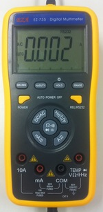

# Victor70C software for Linux

Victor 70C is a Digital Multimeter (DMM) made by Shenzhen Victor Hi-Tech 
Co., Ltd. It is also distributed as OEM by different companies. For example, 
in Brazil, it is sold as EZA EZ-735 (see the following picture).  

Unfortunately, there is no open source software available to access this DMM in Linux.

# Installing 

This software uses HIDAPI to access the USB interface on Linux. Since HIDAPI 
is a multi-platform library, this software may also work with Windows and OS X 
(Although it has not been tested yet).

So, the first step is download and build HIDAPI:

	git clone git://github.com/signal11/hidapi.git
	cd hidapi/linux
	make

Download, build and install the victor70C app:

	git clone git://github.com/mvneves/victor70c
	cd victor70c
	# edit the right HIDAPI path in the Makefile
	make
	make install

# Usage examples

Example of how to read AC Amps for 5 seconds:

	$ victor70c 5
	1334180272.776843 0.001 A AC
	1334180272.880754 0.001 A AC
	1334180273.472806 0.001 A AC
	1334180274.048828 0.001 A AC
	1334180274.592822 0.001 A AC
	1334180275.200768 0.002 A AC
	1334180275.776835 0.001 A AC
	1334180276.320831 0.001 A AC
	1334180276.896835 0.001 A AC
	1334180277.440811 0.001 A AC
	1334180278.080847 0.001 A AC

# References

- A USB interface for Victor 86B Digital Multimeter using HIDAPI: 
[http://code.google.com/p/victor86b-usb-interface](http://code.google.com/p/victor86b-usb-interface)
- A closed-source DDM app for Victor 86B and 86C: 
[http://homepage.ntlworld.com/green_bean/coffee/roastlogger/dmmdetails.html](http://homepage.ntlworld.com/green_bean/coffee/roastlogger/dmmdetails.html)
- Victor 86C multimeter USB encoding for linux:
[http://www.daveansell.co.uk/?q=node/44](http://www.daveansell.co.uk/?q=node/44)

